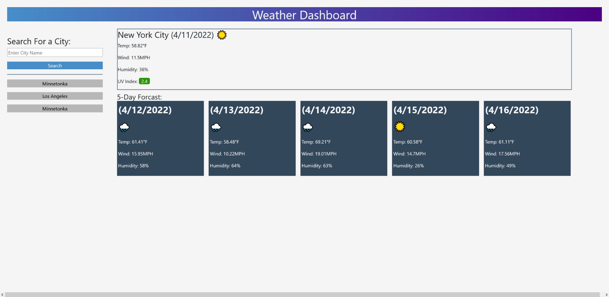

# Weather Dashboard

Challenge 6

## Features

Search input fetches lat and lon for entered city name and will inform user if city name is invalid

Current weather data shows:

- temperature

- wind speed

- humidity

- UV index color coded for severity

5-day forcast shows:

- temperature

- wind

- humidity

Each day has an emoji representing the current weather conditions

Previously searched cities will populate below the search button and clicking them will fetch their weather data

## [Deployed Site](https://carljmcgee.github.io/Weather-Dashboard/)

